

 

  <h3 align="center">PEMROGRAMAN MOBILE</h3>
    
  
    
  <h3 align="center">Falendika Tegar Pratama</h3>
  <h3 align="center">3G - D4TI</h3>
  <h3 align="center">2141720107</h3>

  

<h1 align="center">Laporan Kuis Pemrograman Mobile</h1>

 

## Kuis

### Tugas 1

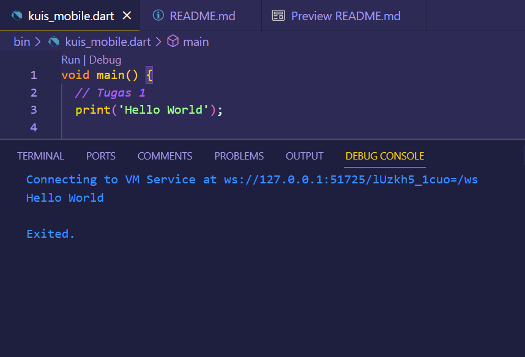

 

Penjelasan: 

Kode program tersebut adalah program yang akan mencetak teks "Hello World" ke konsol.

Jadi, keseluruhan program melakukan hal berikut:
- Mendeklarasikan fungsi `main()` sebagai titik masuk utama program.
- Di dalam fungsi `main()`, mencetak teks "Hello World" ke konsol.

 

### Tugas 2

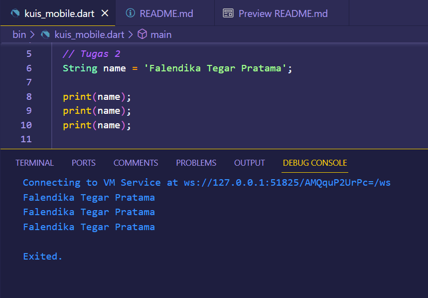

 

Penjelasan: 

Kode program Dart tersebut adalah program yang berfungsi untuk membuat dan menggunakan variabel, setelah itu mencetak nilai variabel tersebut ke konsol. 

Jadi, keseluruhan program melakukan hal berikut:
- Mendeklarasikan variabel `name` dan menginisialisasinya dengan nilai 'Falendika Tegar Pratama'.
- Mencetak nilai dari variabel `name` ke konsol sebanyak tiga kali.

Jadi kode program tersebut digunakan untuk mengilustrasikan cara mendeklarasikan variabel, menginisialisasinya dengan nilai, dan mencetak nilai variabel ke konsol dalam bahasa Dart.

 

### Tugas 3

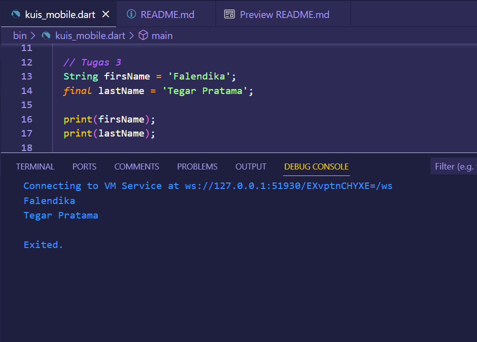

 

Penjelasan: 

Kode program Dart tersebut adalah cara penggunaan variabel dan kata kunci`final`. 

Jadi, keseluruhan program melakukan hal berikut:
- Mendeklarasikan variabel `firsName` dengan nilai 'Falendika'.
- Mendeklarasikan variabel `lastName` dengan kata kunci `final` dan nilai 'Tegar Pratama'.
- Mencetak nilai dari kedua variabel ke konsol.

Variabel `lastName` dideklarasikan sebagai `final`, sehingga nilainya tidak dapat diubah setelah inisialisasi.

 

### Tugas 4 (Pertama)

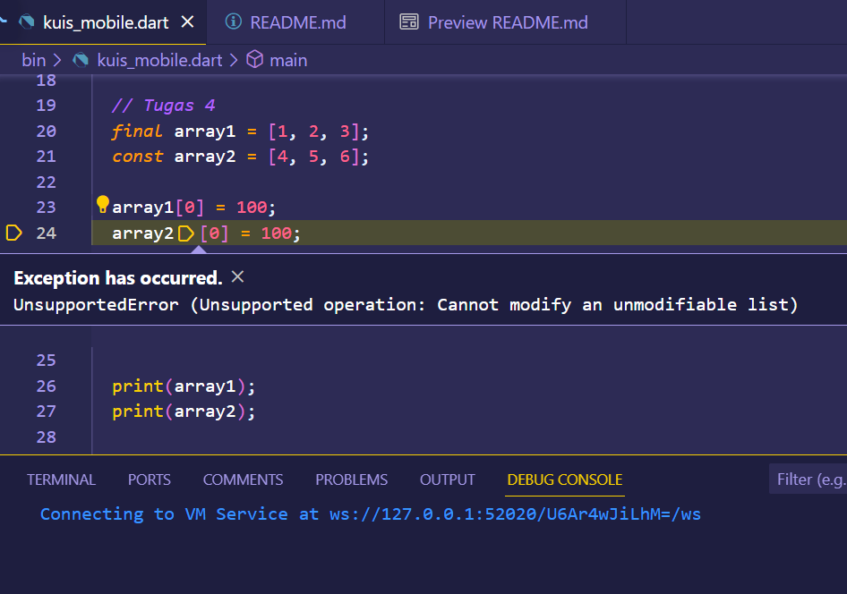

 

Penjelasan: 

Kode program mengalami error ketika dijalankan karena perbedaan antara penggunaan `final` dan `const` dalam Dart.
1. `final array1 = [1, 2, 3];`: Variabel `array1` dideklarasikan sebagai `final`, yang berarti kita dapat mengubah referensi variabel tersebut, tetapi kita tidak dapat mengubah objek yang ditunjuk oleh referensi tersebut. Dalam hal ini, kita dapat mengganti `array1` dengan mengarahkannya ke daftar lain, tetapi kita tidak dapat mengubah isi daftar yang ada.
2. `const array2 = [4, 5, 6];`: Variabel `array2` dideklarasikan sebagai `const`, yang berarti kita tidak dapat mengubah referensi variabel atau isi daftar tersebut setelah inisialisasi. Itu berarti kita tidak dapat mengubah `array2` atau elemennya.

Untuk memperbaiki error ini, kita bisa mengganti variabel `const` dengan `final` pada `array2`, jika kita ingin mengubah elemennya setelah inisialisasi.

Perbaikan:

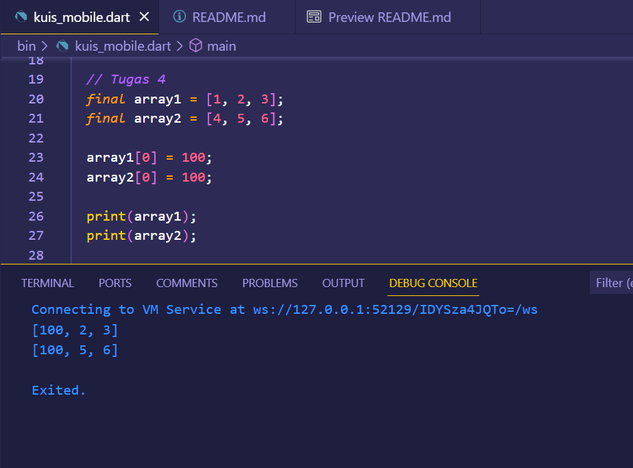

 

Pada program diatas sudah diperbaiki dengan mengganti variabel `const` dengan `final` pada `array2`.

Penjelasan: 

Kode program Dart tersebut akan menghasilkan kesalahan saat mencoba mengubah elemen-elemen dalam `array1` dan `array2`. 

Jadi bisa diketahui bahwa elemen pertama dari `array1` dan `array2` telah berhasil diubah menjadi 100. Meskipun variabel `array1` dan `array2` dideklarasikan sebagai `final`, kita masih dapat mengubah elemen-elemen dalam list tersebut karena `final` hanya membatasi perubahan referensi, bukan elemen-elemen di dalamnya.

### Tugas 4 (Kedua)

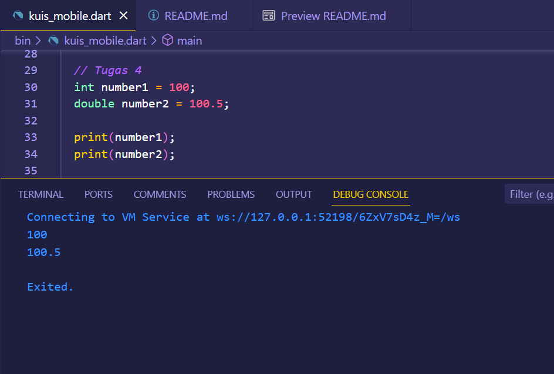

 

Penjelasan: 

Kode program Dart tersebut adalah penggunaan variabel untuk menyimpan nilai numerik dan mencetaknya ke konsol. 

Jadi, keseluruhan program melakukan hal berikut:
- Mendeklarasikan variabel `number1` dengan nilai 100 dan tipe data `int`.
- Mendeklarasikan variabel `number2` dengan nilai 100.5 dan tipe data `double`.
- Mencetak nilai dari `number1` dan `number2` ke konsol.

Jadi kode program ini mengilustrasikan cara menggunakan variabel dengan tipe data `int` dan `double` untuk menyimpan nilai numerik dan mencetaknya ke konsol dalam bahasa Dart.

### Tugas 5

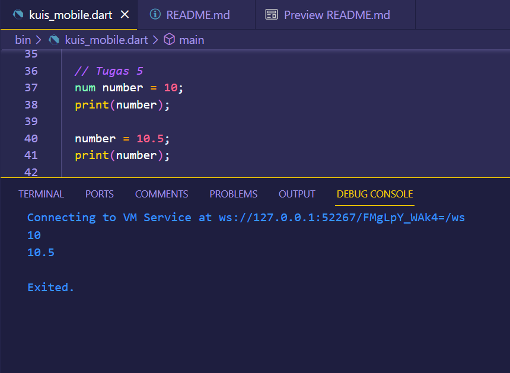

 

Penjelasan: 

Kode program Dart di atas menggunakan tipe data `num` untuk variabel `number`, yang memungkinkan variabel tersebut untuk menyimpan baik nilai bilangan bulat (integer) maupun nilai bilangan desimal (floating-point). 

Jadi, keseluruhan program melakukan hal berikut:
- Mendeklarasikan variabel `number` dengan tipe data `num` dan menginisialisasinya dengan nilai 10 (bilangan bulat).
- Mencetak nilai awal variabel `number` ke konsol.
- Mengubah nilai `number` menjadi 10.5 (bilangan desimal).
- Mencetak nilai yang diperbarui dari variabel `number` ke konsol.

Program ini mengilustrasikan penggunaan tipe data `num` dalam Dart yang memungkinkan variabel untuk menyimpan berbagai jenis nilai numerik.

### Tugas 6

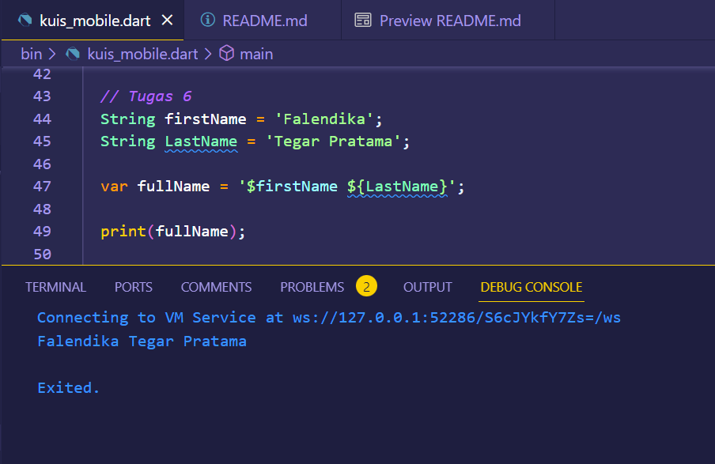

 

Penjelasan:

Kode program Dart di atas adalah penggunaan string interpolation (penggabungan string) untuk membuat variabel `fullName` yang berisi gabungan dari `firstName` dan `LastName`.

Jadi, keseluruhan program melakukan hal berikut:
- Mendeklarasikan variabel `firstName` dan `LastName` untuk menyimpan nama depan dan nama belakang.
- Menggunakan string interpolation untuk menggabungkan kedua variabel ini dalam `fullName`.
- Mencetak `fullName` ke konsol.

Program ini mengilustrasikan cara menggabungkan string dan variabel menggunakan string interpolation dalam bahasa Dart. String interpolation adalah teknik yang digunakan dalam bahasa Dart (dan banyak bahasa pemrograman lainnya) untuk menggabungkan nilai variabel atau ekspresi lainnya ke dalam string. Ini memungkinkan kita untuk membuat string yang lebih dinamis dan membentuk teks berdasarkan nilai variabel yang sedang kita gunakan.

### Tugas 7

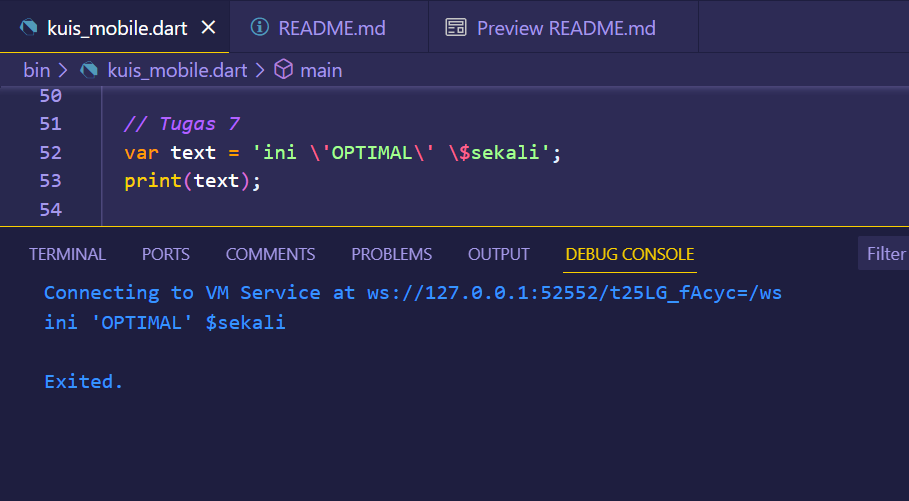

 

Penjelasan: 

Kode program Dart di atas adalah penggunaan karakter escape untuk mengatasi masalah dengan karakter khusus dalam string. Kita mendeklarasikan variabel `text` yang berisi string dengan karakter khusus seperti tanda kutip tunggal (`'`) yang di-escape (\') dan karakter dolar (`$`) yang di-escape juga. Hasilnya adalah string `ini 'OPTIMAL' $sekali` yang dicetak.

Jadi, kode program tersebut mengilustrasikan penggunaan karakter escape (`\`) dalam string untuk mengatasi karakter khusus seperti tanda kutip satu dan tanda dolar dalam string yang dikelilingi oleh tanda kutip satu tunggal.

### Tugas 8

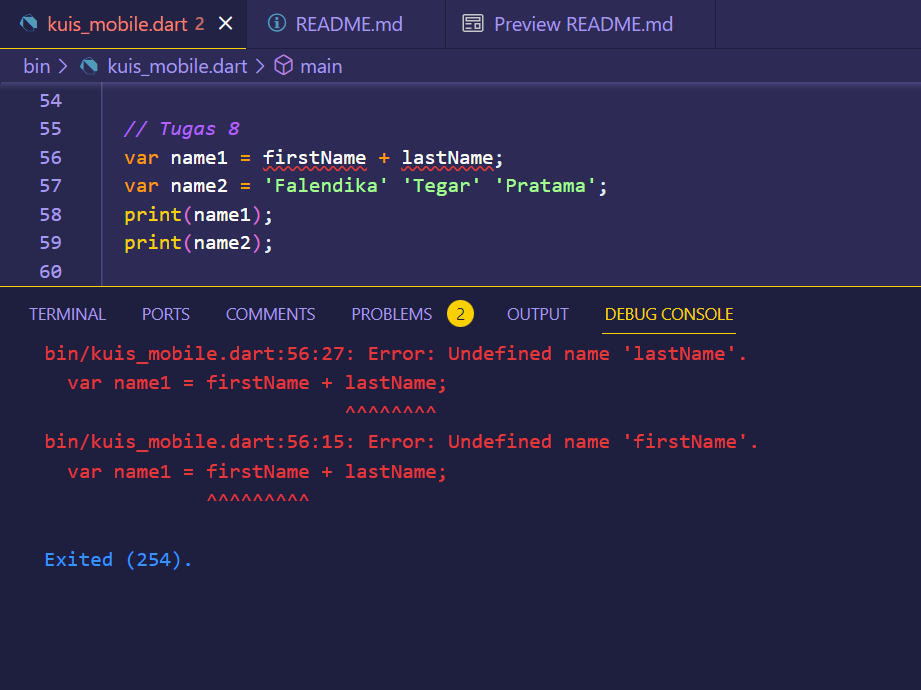

 

Penjelasan: 

Kode program mengalami error ketika dijalankan karena variabel `firstName` dan `lastName` tidak didefinisikan sebelum digunakan. Dart memerlukan definisi atau inisialisasi variabel sebelum digunakan dalam kode. Kita perlu mendefinisikan dan menginisialisasi `firstName` dan `lastName` sebelum Anda menggabungkannya dalam variabel `name1`. 

Perbaikan:

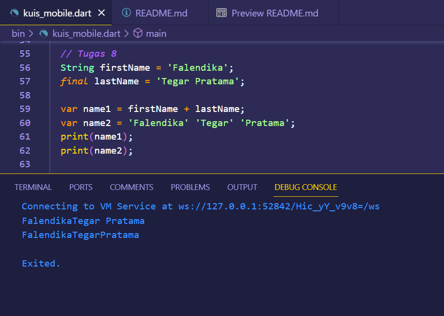

 

Penjelasan:

Kode program telah diperbaiki dengan mendeklarasikan dan menginisialisasi variabel `firstName` dan `lastName`, kemudian menggabungkannya menggunakan operator `+` dalam variabel `name1`. Variabel `name2` juga telah didefinisikan. Setelah perbaikan ini, program akan berjalan tanpa kesalahan.

1. `var name1 = firstName + lastName;`
   - Di baris ini, kita menggabungkan variabel `firstName` dan `lastName` menggunakan operator `+`. Ini akan menghasilkan nilai 'FalendikaTegar Pratama' dan mengassignnya ke variabel `name1`.
2. `var name2 = 'Falendika' 'Tegar' 'Pratama';`
   - Di baris ini, kita menggabungkan tiga string berurutan tanpa menggunakan operator penggabungan seperti `+` atau tanda penghubung (`+`). Ini juga akan menghasilkan nilai 'FalendikaTegarPratama' dan mengassignnya ke variabel `name2`.

### Tugas 9

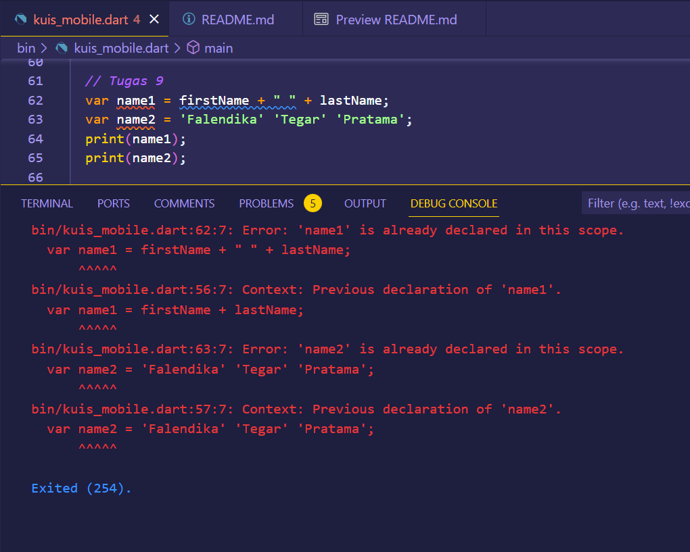

 

Penjelasan:

Kode program mengalami error ketika dijalankan karena kesalahan pada variabel yang sudah dideklarasikan, kita mendeklarasikan variabel `name1` dan `name2` lebih dari sekali. Variabel tersebut sudah dideklarasikan sebelumnya di dalam kode yang sama.

Perbaikan:

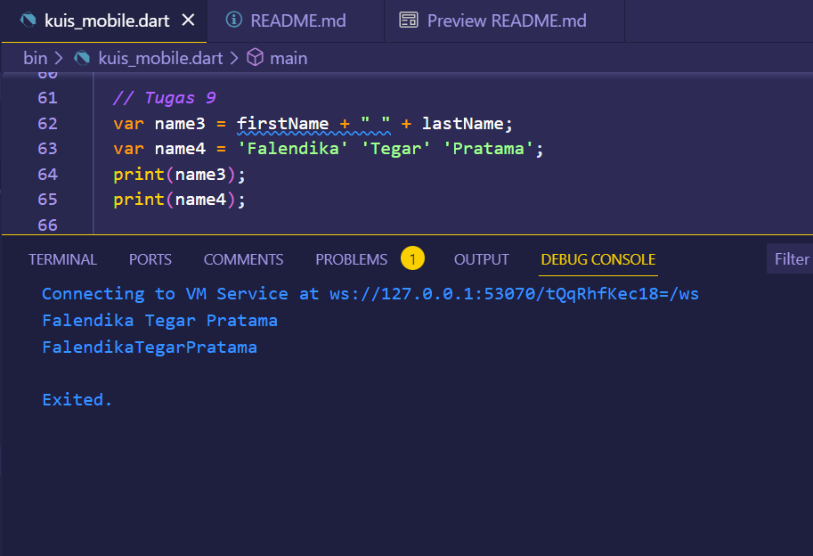

 

Penjelasan: 

Kode program telah diperbaiki dengan mengganti nama variabel name1 menjadi name3 dan name2 menjadi name4. Setelah perbaikan ini, kode akan berjalan tanpa kesalahan.

### Tugas 10

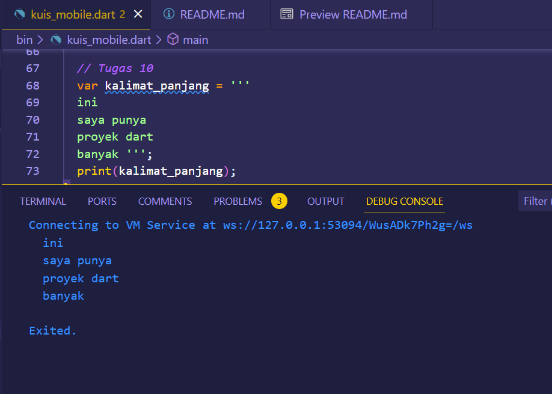

 

Penjelasan:

Kode program Dart di atas adalah penggunaan tanda kutip tiga (triple quotes) untuk mendefinisikan string panjang dalam bahasa Dart.

`var kalimat_panjang = ''' ... '''`
   - Pada baris ini, kita mendefinisikan variabel `kalimat_panjang` dan menginisialisasinya dengan sebuah string yang dimulai dan diakhiri dengan tiga tanda kutip tunggal (`'''`). Ini adalah cara untuk membuat string multi-baris dalam Dart.

Jadi dengan menggunakan tanda kutip tiga (`'''` atau `"""`) memungkinkan kita untuk membuat string multi-baris dengan lebih mudah tanpa perlu menghindari karakter baris baru. Ini berguna ketika kita ingin menyimpan teks panjang atau format yang kompleks dalam variabel string.